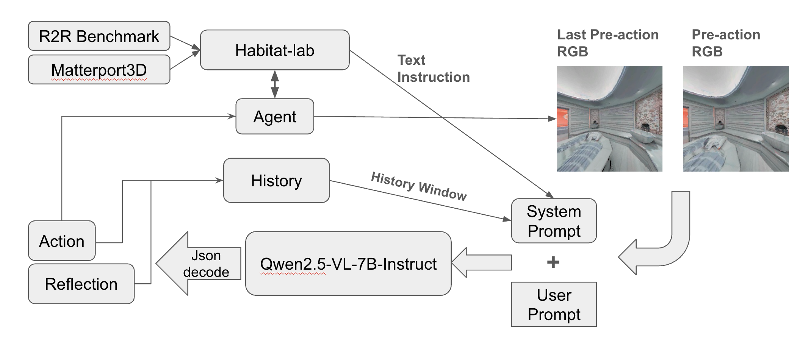

# 🔌 Plug‑and‑Play Navigation Framework using Vision‑Language Model

> A modular, extensible framework for language‑guided embodied navigation that leverages a Vision‑Language Model (VLM) (tested with Qwen2.5‑VL) to translate raw simulator observations into high‑level actions.

---

## 📖 Table of Contents

- [🚀 Overview](#-overview)  
- [🖼 Architecture](#-architecture)  
- [✨ Features](#-features)  
- [⚙️ Requirements](#️-requirements)  
- [📥 Installation](#-installation)  
- [🚦 Quick Start](#-quick-start)  
- [🛠 Configuration](#-configuration)  
- [📁 Repository Structure](#-repository-structure)  
- [🔍 Example Usage](#-example-usage)  
- [📈 Evaluation](#-evaluation)  
- [🤝 Contributing](#-contributing)  
- [📄 License](#-license)  
- [📚 Citation](#-citation)

---

## 🚀 Overview

This project implements a **plug‑and‑play navigation loop** comprised of four interchangeable modules:

1. **Visual Interpreter** — Extracts scene representations (objects, depth) from raw simulator observations.  
2. **VLM Agent (Qwen2.5‑VL)** — Receives visual inputs + historic context to generate natural‑language‑grounded navigation actions.  
3. **Action Interpreter** — Converts high‑level action tokens into simulator API calls.  
4. **Simulator Wrapper** — Provides a unified interface to 3D environment

A **History Manager** persistently stores timestep metadata and constructs a navigable graph of visited locations (Time‑Steps + Navi‑Graph).

---

## 🖼 Architecture



1. Simulator → Visual Interpreter  
2. Visual Interpreter → VLM Agent  
3. VLM Agent → Action Interpreter  
4. Action Interpreter → Simulator  

History Manager maintains bidirectional context with VLM Agent.

---

## ✨ Features

- 🔄 **Modular design** — swap in/out any Vision model, simulator, or planner  
- 📊 **Persistent memory** — builds a topological Navi‑Graph for long‑horizon tasks  
- 💬 **Natural‑language actions** — driven by state‑of‑the-art VLM (Qwen2.5‑VL)  
- ⚙️ **Simulator‑agnostic** —  

---

## ⚙️ Requirements

Install dependencies:

```bash

```

---

## 📥 Installation

```bash

```

---

## 🚦 Quick Start


```bash

```

---

## 🛠 Configuration

All hyperparameters live in `.default.yaml`. Key sections:

```yaml

```

---

## 📁 Repository Structure

```

```

---

## 🔍 Example Usage


---

## 📈 Evaluation


---

## 🤝 Contributing

1. Fork → Clone → Create feature branch  
2. Add tests for new modules  
3. Submit PR → Review → Merge  

---

## 📄 License

This project is MIT Licensed. See `LICENSE` for details.

---

## 📚 Citation

If you find our work helpful, feel free to give us a cite:
```
@misc{oobvlm,
    title = {Plug‑and‑Play Navigation Framework using Vision‑Language Model},
    url = {https://github.com/YichengDuan/oobvlm},
    author = {Yicheng Duan, Kaiyu Tang},
    month = {April},
    year = {2025}
}
```
